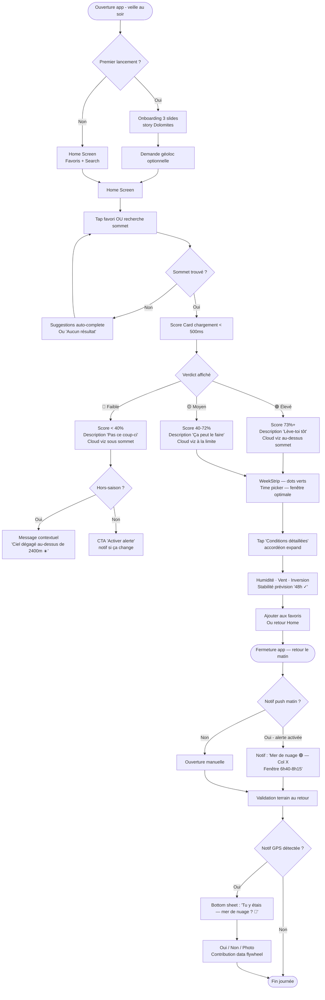
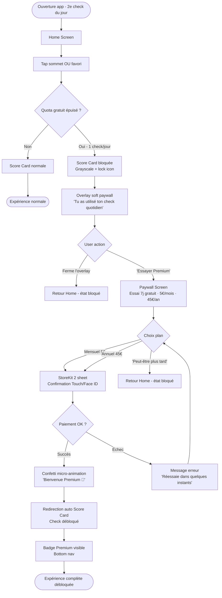
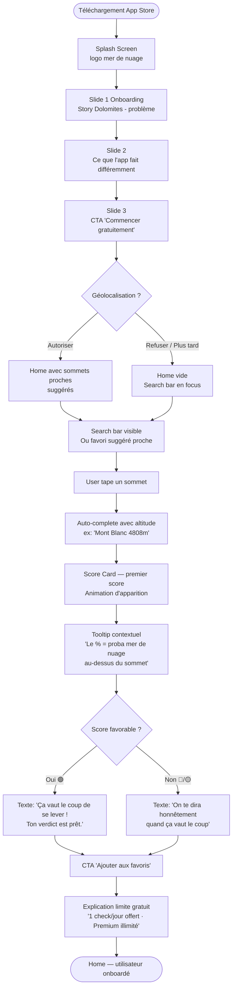
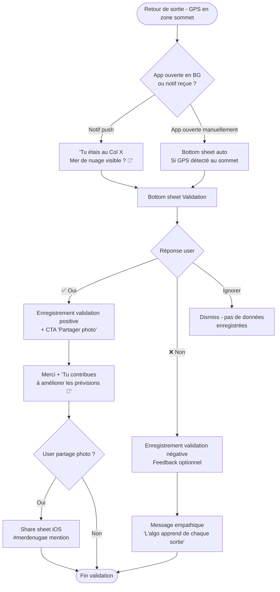

# UX Design Specification — mer de nuage

**Author:** Alex
**Date:** 2026-03-17

---

<!-- UX design content will be appended sequentially through collaborative workflow steps -->

## Executive Summary

### Project Vision

mer de nuage répond à une question précise : "Est-ce que je vais voir une mer de nuage depuis ce sommet à cette heure ?". L'app traduit des données météo complexes (base nuageuse, humidité, inversions thermiques, vent) en un score de probabilité unique, lisible en secondes. Elle s'adresse aux randonneurs, alpinistes et photographes qui veulent maximiser leurs sorties en altitude.

### Target Users

**Primaire — Le Planificateur de Sortie** (randonneurs, alpinistes) : consulte J-1 à J-3, décision binaire (je me lève ou pas), peu de temps, besoin de confiance dans la réponse. Usage terrain, souvent en zone de faible connectivité. Cherche simplicité et rapidité.

**Secondaire — Le Photographe Outdoor** : timing précis (lever de soleil), planification plus avancée (J+5/7), sensible à l'heure et à la lumière. Prêt à payer pour la précision. Veut potentiellement plusieurs sommets à comparer.

**Tertiaire — L'Enthousiaste Météo** : curieux du phénomène, veut comprendre les conditions, partage ses observations. Profil data flywheel — va valider terrain et contribuer à la qualité du modèle.

### Key Design Challenges

1. **Rendre le score crédible** : afficher 73% sans contexte = chiffre vide. L'UX doit accompagner le score de signaux de confiance (conditions météo sous-jacentes) sans submerger.
2. **Réponse < 3 secondes** : l'utilisateur type consulte au réveil, en mode décision rapide. L'écran principal doit être immédiatement lisible, sans navigation.
3. **Freemium au bon moment** : le mur payant doit intervenir après que l'utilisateur a compris la valeur, pas avant. Gestion fine des états libre/limité/bloqué.
4. **Deux contextes d'usage** : planification (avant la sortie) et validation terrain (pendant/après). UX et tone différents pour chaque moment.

### Design Opportunities

1. **Visualisation émotionnelle du score** : une représentation visuelle de la mer de nuage (altitude couche vs sommet) crée une connexion émotionnelle qu'aucune app météo concurrente n'a.
2. **Onboarding narratif différenciant** : le storytelling "problème des Dolomites" est rare et mémorable — à maximiser visuellement dans l'onboarding.
3. **Minimalisme organique** : DA personnelle d'Alex (beige chaud, Josefin Sans, dark `#1A1A1A`) appliquée à une app de données = contraste rare et premium dans le segment outdoor.

## Core User Experience

### Defining Experience

L'expérience centrale de mer de nuage tient en une phrase :
**"Je tape un sommet, je choisis une date/heure, j'obtiens un score."**

Ce loop de 10 secondes maximum est le cœur du produit. Tout le reste —
notifications, abonnement, validation terrain — est au service de ce moment.
L'app n'est pas une app météo qu'on explore ; c'est un oracle qu'on consulte.

### Platform Strategy

- **iOS-first** (iPhone 375pt SE → 430pt Pro Max) — audience outdoor = Apple dominante
- **Touch-based** — navigation one-thumb possible sur l'écran principal
- **Offline-light** : affichage des dernières prévisions chargées si no signal
  (randonneurs en zone faible connectivité)
- **Expo/React Native** — partage des conventions et du design system Perfect Boulder
  (structure screens, ThemeContext, i18n-js)
- **Dark mode natif** via design tokens — usage terrain la nuit / au lever du soleil

### Effortless Interactions

Les interactions qui doivent être **zéro-friction** :

1. **Recherche de sommet** — autocomplete rapide, résultat en 1-2 frappes,
   historique des favoris en surface immédiatement
2. **Lecture du score** — chiffre + couleur sémantique lisibles d'un coup d'œil,
   même sous fort éclairage outdoor (contraste élevé)
3. **Changement date/heure** — picker fluide, pas de formulaire, scroll ou swipe
4. **Retour à l'écran principal** — depuis n'importe où dans l'app, 1 tap max

### Critical Success Moments

1. **Premier score affiché** (onboarding → résultat) : c'est le "aha moment".
   Si le premier score est crédible et beau, l'utilisateur est converti.
2. **Notification reçue → sortie réussie** : boucle de confiance.
   L'app a prédit, l'utilisateur est parti, il a vu la mer de nuage. Fidélisation maximale.
3. **Validation terrain** : l'utilisateur poste une photo après la sortie.
   Sentiment de contribution, gamification légère.
4. **Paywall rencontré** : doit être perçu comme naturel ("j'ai eu 3 prévisions gratuites,
   j'en veux plus") et non comme un blocage brutal.

### Experience Principles

1. **"Oracle, pas dashboard"** — une réponse forte et lisible,
   pas un tableau de bord météo à interpréter soi-même.
2. **"Confiance progressive"** — le score d'abord, les données météo sous-jacentes
   pour qui veut creuser (accordéon / tap to expand).
3. **"Outdoor-first"** — lisibilité en plein soleil, one-thumb possible,
   offline dégradé gracieux, dark mode natif.
4. **"Émotion avant données"** — la visualisation de la couche nuageuse vs altitude sommet
   doit faire ressentir le phénomène avant de l'expliquer.

## Desired Emotional Response

### Primary Emotional Goals

**L'émotion principale : "Privilégié·e"**
L'utilisateur qui voit un score élevé doit ressentir qu'il accède à une information rare,
que seuls les initiés connaissent. Pas "j'ai vérifié la météo" — mais
"j'ai un insider qui me dit si ça va valoir le coup".

**Émotion secondaire : "Confiant·e"**
Le score doit inspirer confiance — pas de doute sur la méthode,
pas d'anxiété sur la fiabilité. L'utilisateur repart avec une décision,
pas avec des questions.

### Emotional Journey Mapping

| Moment | Émotion visée | Émotion à éviter |
|--------|---------------|-----------------|
| **Découverte / onboarding** | Curiosité + "waouh, ça existe ça ?" | Confusion, scepticisme |
| **Première recherche sommet** | Anticipation | Friction |
| **Lecture du score** | Clarté + conviction | Incertitude, surcharge |
| **Explication des conditions** | Compréhension + confiance | Submersion de données |
| **Paywall rencontré** | "C'est normal, c'est juste" | Frustration, sentiment de piège |
| **Notification alertes** | "L'app pense à moi" | Spam, intrusion |
| **Post-sortie / validation** | Fierté + appartenance | Obligation, corvée |
| **Retour usage récurrent** | Rituel, familier, fiable | Routine froide |

### Micro-Emotions

- **Confiance > Scepticisme** : le score doit paraître scientifique et honnête,
  pas marketing ("85% de chances !" sonne creux)
- **Anticipation > Anxiété** : l'attente du résultat doit être courte et
  accompagnée d'un feedback visuel apaisant (loader doux, pas spinner agressif)
- **Appartenance > Isolation** : la validation terrain et les photos d'autres utilisateurs
  créent un sentiment de communauté silencieuse de passionnés
- **Accomplissement > Frustration** : chaque prévision consultée = micro-succès visible

### Design Implications

| Émotion | Implication UX |
|---------|----------------|
| **Privilégié·e** | Score affiché grand, sobre, avec une micro-visualisation exclusive (couche nuageuse vs sommet). Pas de ads, pas de clutter. |
| **Confiant·e** | Détails météo sous-jacents accessibles en tap (pas cachés, pas imposés). Indicateur de fiabilité discret. |
| **Anticipation positive** | Transition douce vers le résultat, animation subtile de la couche nuageuse qui se place. |
| **Appartenance** | Galerie de photos terrain discrète, compteur de validations communautaires. |
| **Paywall "juste"** | Message de limite formulé en bénéfice ("Débloquer les prévisions illimitées") plutôt qu'en punition. Compteur visible dès le début. |

### Emotional Design Principles

1. **Sobriété émotionnelle** — ne pas sur-gamifier ni sur-animer. L'émotion vient
   de la beauté du score et de sa justesse, pas d'effets visuels tape-à-l'œil.
2. **Confiance par la transparence** — montrer les données sources sur demande,
   pas les cacher. La confiance se gagne, elle ne se décrète pas.
3. **Rituels discrets** — encourager l'usage régulier par des patterns habituels
   (favoris en surface, historique visible) plutôt que des notifications agressives.
4. **Beauté fonctionnelle** — chaque élément visuel sert la lisibilité du score.
   La DA organique d'Alex (beige, Josefin Sans, dark) renforce le sentiment
   de "app artisanale de qualité", pas d'outil mass-market.

## UX Pattern Analysis & Inspiration

### Inspiring Products Analysis

#### Revolut / Finly
**Ce qui fonctionne :**
- Dark mode dense mais aéré — l'information financière est hiérarchisée sans submerger
- Cards à coins arrondis (border-radius 16-20px) sur fond légèrement plus clair que le bg
- Chiffre principal très grand, secondary info en caption grisée
- Navigation bottom tabs claire, icons + labels courts
- Glassmorphism discret sur les overlays

**Pattern extractible pour mer de nuage :**
→ Afficher le score % comme Revolut affiche le solde : **grand, centré, dominant**.
→ Cards conditions météo (humidité, vent, etc.) en secondary cards sous le score principal.

#### Strava
**Ce qui fonctionne :**
- Bottom nav 5 tabs, icon + label, tab active = couleur primaire forte
- Cards activité avec données chiffrées lisibles en scan (distance, pace)
- Couleur primaire orange très présente → signal d'action, énergie, sport
- Profil utilisateur sobre, stats bien organisées
- Onboarding social ("mutual friends on Strava") = trust social proof

**Pattern extractible pour mer de nuage :**
→ Bottom nav 4 tabs (Home / Recherche / Favoris / Profil) même structure.
→ Card prévision = même lisibilité que card activité Strava : score + altitude + date en scan < 2s.
→ Validation terrain = même logique que log d'activité Strava (post-sortie, friction minimale).

#### Instagram dark mode
**Ce qui fonctionne :**
- Bottom nav iOS flottante glassmorphique — fond semi-transparent, blur
- Fond `#1A1A1A` pur, pas de gris complexe — contraste très propre
- Stories circulaires en highlight = accès rapide contenu récurrent
- Tabs profil = navigation contenu secondaire sans quitter l'écran

**Pattern extractible pour mer de nuage :**
→ Bottom nav glassmorphique sur dark mode — flottante, blur backdrop.
→ Favoris présentés en cards horizontales scrollables (type stories/highlights) sur l'écran Home.

#### DA personnelle Alex
**Palette extraite :**
- `#EFE8DC` — beige chaud (background light mode)
- `#F7F5F1` — crème clair (surface cards)
- `#E9E4DA` — gris beige (borders, dividers)
- `#D2BA9C` — caramel (accent secondaire)
- `#B28C6E` — mauve brun (accent primaire chaud)
- `#1A1A1A` — dark pur (background dark mode)
- `#5E5E5E` — gris medium (texte secondaire)
- Typo : **Josefin Sans** — géométrique, épuré, un peu vintage, excellent mobile

**Principe DA :** minimalisme artisanal, matières naturelles, pas corporate.

#### Perfect Boulder Design System (référence existante)
- Structure screens, ThemeContext, i18n-js déjà éprouvés → à réutiliser
- Nunito Sans (PB) → **remplacer par Josefin Sans** pour mer de nuage
- Scale typographique modulaire 1.25× → conserver le principe, adapter les valeurs
- Conventions React Native (PascalCase screens, contexts, hooks) → réutiliser à l'identique
- Bottom nav 4 tabs → même pattern confirmé

### Transferable UX Patterns

**Navigation :**
- Bottom tab bar 4 items, glassmorphic sur dark, opaque sur light — (Strava + Instagram)
- Pas de header lourd — écran principal immersif, sommet + score prend 80% de l'espace

**Interaction :**
- Score = chiffre dominant centré, très grand (type Revolut solde bancaire)
- Swipe horizontal sur les jours de prévision (J0 → J+7) — type calendrier météo
- Tap sur le score → expand détails conditions (accordion, pas nouvelle page)
- Pull-to-refresh pour actualiser les prévisions

**Visuel / Data display :**
- Cards secondary pour les indicateurs météo (humidité, vent, inversion) — style Revolut mini-cards
- Visualisation altitude : diagramme simple montrant couche nuageuse vs sommet (unique différenciateur)
- Couleur sémantique du score : `#4CAF50` (≥70%) / `#FF9800` (40-70%) / `#F44336` (<40%)

### Anti-Patterns to Avoid

- **Dashboard météo complet** : ne pas afficher 12 métriques sur l'écran principal — on perd la lisibilité
- **Paywall abrupt** : bloquer avant que l'utilisateur ait compris la valeur → frustration immédiate
- **Onboarding multi-pages sans valeur** : slides de features génériques → sauter directement à la valeur
- **Notifications push trop fréquentes** : l'app doit être un oracle discret, pas un spammeur
- **Bottom nav avec labels trop longs** : max 8 caractères par tab
- **Animations trop longues** : loader > 1.5s perçu comme lent sur terrain

### Design Inspiration Strategy

**À adopter directement :**
- Structure bottom nav 4 tabs glassmorphic (Strava + Instagram)
- Score dominant centré grand format (Revolut pattern)
- Fond `#1A1A1A` dark / `#EFE8DC` light — directement depuis DA personnelle
- Josefin Sans comme typo principale (DA personnelle)
- Conventions code React Native Perfect Boulder (structure, ThemeContext, i18n)

**À adapter :**
- Scale typographique Perfect Boulder → recalibrer avec Josefin Sans (géométrique = proportions différentes)
- Cards Revolut → version plus organique (coins arrondis + teinte beige vs gris froid)
- Validation terrain Strava → simplifier à 1 photo + note de confirmation (moins de friction)

**À éviter :**
- Orange Strava → trop sport/énergie, pas dans l'univers contemplatif mer de nuage
- Couleurs Instagram saturées → garder la palette désaturée / organique d'Alex
- Grilles denses type feed social → mer de nuage = 1 sommet à la fois, pas un feed

## Design System Foundation

### Design System Choice

**Custom Design System léger — React Native primitives + tokens TypeScript**

Approche hybride : aucune librairie UI externe, composants maison basés sur les
primitives React Native, pilotés par un système de tokens TypeScript.

### Rationale for Selection

- **DA forte et définie** : palette, typo et principes visuels déjà établis via la DA personnelle —
  toute lib externe nécessiterait des overrides massifs qui coûtent plus de temps qu'ils n'en font gagner.
- **Solo dev iOS-first** : le coût d'apprentissage d'une lib externe (NativeBase, Tamagui)
  dépasse le bénéfice pour un périmètre MVP ciblé.
- **Héritage Perfect Boulder** : conventions `colors.ts`, `spacing.ts`, `typography.ts`,
  `ThemeContext` déjà éprouvées et opérationnelles — réutilisation directe.
- **Expo/RN primitives** : suffisantes pour les composants de mer de nuage
  (pas de table, pas de data grid complexe, juste cards + affichage score + picker).

### Implementation Approach

```
mobile/src/constants/
├── colors.ts        # Tokens couleur light/dark
├── typography.ts    # Échelle Josefin Sans
├── spacing.ts       # Grid 4px base
└── radius.ts        # Border-radius tokens

mobile/src/contexts/
└── ThemeContext.tsx  # Hook useTheme() → { colors, spacing, typo }

mobile/src/components/
├── ScoreDisplay.tsx   # Score % dominant + couleur sémantique
├── PeakCard.tsx       # Card sommet (nom + altitude + score mini)
├── ConditionBadge.tsx # Badge météo (humidité, vent, inversion)
├── WeekStrip.tsx      # Sélecteur J0→J+7 horizontal
├── CloudLayer.tsx     # Visualisation couche nuageuse vs altitude
└── Button.tsx         # Bouton primary/secondary/ghost
```

### Customization Strategy

**Palette tokens (light / dark) :**

| Token | Light | Dark |
|-------|-------|------|
| `bg.primary` | `#EFE8DC` | `#1A1A1A` |
| `bg.surface` | `#F7F5F1` | `#242424` |
| `border` | `#E9E4DA` | `#333333` |
| `accent.primary` | `#B28C6E` | `#D2BA9C` |
| `accent.secondary` | `#D2BA9C` | `#B28C6E` |
| `text.primary` | `#1A1A1A` | `#F7F5F1` |
| `text.secondary` | `#5E5E5E` | `#A0A0A0` |
| `score.high` | `#4CAF50` | `#66BB6A` |
| `score.medium` | `#FF9800` | `#FFA726` |
| `score.low` | `#F44336` | `#EF5350` |

**Typographie (Josefin Sans) :**

| Token | Taille | Weight | Usage |
|-------|--------|--------|-------|
| `display` | 64px | 700 | Score % principal |
| `h1` | 28px | 600 | Nom du sommet |
| `h2` | 22px | 600 | Titres sections |
| `body` | 16px | 400 | Texte courant |
| `label` | 14px | 600 | Labels, badges |
| `caption` | 12px | 400 | Métadonnées, altitude |

**Spacing — grid 4px :**
`xs=4`, `sm=8`, `md=16`, `lg=24`, `xl=32`, `xxl=48`

## Defining Experience

### 2.1 L'Expérience Définissante

**"Chercher un sommet → voir son score mer de nuage → décider."**

Formulation produit : *"Consulte la probabilité de mer de nuage pour ton sommet."*

C'est l'action que l'utilisateur décrira à ses amis : *"J'ai une app qui me dit si ça vaut
le coup de se lever à 4h pour monter au Vercors."*
Si on nail cette expérience — rapidité, lisibilité, crédibilité — tout le reste suit.

### 2.2 Modèle Mental de l'Utilisateur

**Comment l'utilisateur résout-il ça aujourd'hui ?**
- Il consulte plusieurs apps météo (Météo France, Windy, Weather Underground)
- Il cherche manuellement la base des nuages, l'altitude, l'humidité
- Il interprète lui-même si "ça va passer" — souvent faux ou incertain
- Il demande dans des groupes Facebook / Discord de randonneurs

**Ce qu'il attend de mer de nuage :**
→ Une réponse, pas des données. "Oui probable / Non peu probable" avec un chiffre.
→ Rapidité : il consulte au réveil ou la veille, il n'a pas 5 minutes.
→ Confiance : si le score dit 82%, il doit pouvoir partir sans vérifier ailleurs.

**Où il risque d'être perdu :**
- Score sans unité claire → "82% de quoi ?"
- Trop de données météo visibles → sentiment de devoir interpréter lui-même
- Changement d'écran pour choisir la date → friction inutile

### 2.3 Success Criteria

- Score affiché en < 2 secondes après sélection sommet
- Aucune question pendant la consultation : le score est auto-explicite
- L'utilisateur comprend le score sans lire de documentation
- Changement de date/heure sans quitter l'écran principal (inline)
- Sur fond blanc en plein soleil : score lisible sans ajuster la luminosité

### 2.4 Pattern UX : Établi + Innovation ciblée

**Établi (utilisateurs ne doivent rien apprendre) :**
- Recherche sommet → autocomplete → sélection : pattern universel
- Bottom nav 4 tabs : navigation standard iOS
- Cards swipables horizontalement : connu de toutes les apps météo

**Innovation ciblée (notre différenciateur) :**
- Visualisation altitude : diagramme couche nuageuse vs sommet — aucune app météo ne fait ça
- Score unique % (pas 6 metrics à interpréter) — oracle, pas dashboard
- Couleur sémantique du score (vert/orange/rouge) lisible sans lire le chiffre

**Métaphore familière utilisée :** baromètre ou jauge de carburant — une seule valeur, claire, directionnelle.

### 2.5 Experience Mechanics

**1. Initiation**
- L'écran Home affiche la dernière prévision consultée (ou vide avec CTA recherche)
- CTA principal : barre de recherche proéminente en haut de l'écran
- Accès rapide : liste des favoris en cards horizontales scrollables sous la barre

**2. Interaction**
```
Utilisateur tape "Vercors" →
  Autocomplete suggère [Moucherotte 1901m, Gerbier de Jonc 1551m, ...]
  Sélection → score chargé immédiatement
  Écran principal mis à jour : score + visualisation couche + date actuelle

Swipe horizontal sur WeekStrip → change le jour (J0→J+6)
Swipe vertical sur l'heure → change le créneau (06h, 08h, 10h...)
Tap sur score → expand accordion conditions (humidité, vent, inversion, base nuage)
```

**3. Feedback**
- Loading : animation douce de la couche nuageuse qui "se pose" (< 1.5s)
- Score coloré : vert immédiatement rassurant, rouge immédiatement dissuasif
- Vibration haptique légère au changement de jour (iOS standard)
- Pas de toast/banner — le score lui-même EST le feedback

**4. Completion**
- Aucun bouton "Valider" — le score s'affiche automatiquement
- L'utilisateur sait qu'il est "done" quand le score est visible et coloré
- CTA secondaire discret : "Activer une alerte pour ce sommet" (badge 🔔)
- Option : ajouter aux favoris (⭐ en haut à droite du sommet)

## Visual Design Foundation

### Color System

**Philosophie :** palette organique désaturée, inspirée des matières naturelles
(pierre, sable, bois clair). Pas de bleu tech, pas de couleurs app météo classique.
Le score lui-même est la seule couleur sémantique forte de l'interface.

**Tokens Light Mode :**

| Token | Valeur | Rôle |
|-------|--------|------|
| `bg.primary` | `#EFE8DC` | Fond principal — beige chaud |
| `bg.surface` | `#F7F5F1` | Fond cards, modals |
| `bg.elevated` | `#FFFFFF` | Inputs, éléments surélevés |
| `border.default` | `#E9E4DA` | Séparateurs, bordures |
| `border.subtle` | `#F0EDE8` | Bordures très discrètes |
| `text.primary` | `#1A1A1A` | Texte principal |
| `text.secondary` | `#5E5E5E` | Labels, captions |
| `text.tertiary` | `#9E9E9E` | Placeholders, métadonnées |
| `accent.primary` | `#B28C6E` | Boutons principaux, liens actifs |
| `accent.secondary` | `#D2BA9C` | Accent léger, highlights |
| `accent.hover` | `#9A7560` | State pressed/hover |

**Tokens Dark Mode :**

| Token | Valeur | Rôle |
|-------|--------|------|
| `bg.primary` | `#1A1A1A` | Fond principal — dark pur |
| `bg.surface` | `#242424` | Fond cards |
| `bg.elevated` | `#2E2E2E` | Inputs, modals |
| `border.default` | `#383838` | Séparateurs |
| `border.subtle` | `#2C2C2C` | Bordures discrètes |
| `text.primary` | `#F7F5F1` | Texte principal |
| `text.secondary` | `#A0A0A0` | Labels, captions |
| `text.tertiary` | `#666666` | Placeholders |
| `accent.primary` | `#D2BA9C` | Boutons (inversé vs light) |
| `accent.secondary` | `#B28C6E` | Accent secondaire |

**Couleurs sémantiques score (identiques light/dark) :**

| Token | Valeur | Condition |
|-------|--------|-----------|
| `score.high` | `#5C9E6E` | ≥ 70% — vert naturel |
| `score.medium` | `#D4904A` | 40–69% — ambre terreux |
| `score.low` | `#C25C4A` | < 40% — rouge brique |
| `score.high.bg` | `rgba(92,158,110,0.12)` | Background badge score élevé |
| `score.medium.bg` | `rgba(212,144,74,0.12)` | Background badge score moyen |
| `score.low.bg` | `rgba(194,92,74,0.12)` | Background badge score faible |

**Bottom nav dark — glassmorphism :**
`backgroundColor: rgba(26,26,26,0.85)` · `backdropFilter: blur(20px)` · `borderTop: 1px solid rgba(255,255,255,0.08)`

### Typography System

**Font principale : Josefin Sans** (`@expo-google-fonts/josefin-sans`)

| Token | Taille | Weight | Line Height | Usage |
|-------|--------|--------|-------------|-------|
| `typo.display` | 72px | 700 | 72px | Score % pleine page |
| `typo.h1` | 28px | 600 | 36px | Nom du sommet |
| `typo.h2` | 22px | 600 | 30px | Titres sections |
| `typo.h3` | 18px | 600 | 26px | Sous-titres |
| `typo.body.lg` | 16px | 400 | 24px | Texte principal |
| `typo.body` | 14px | 400 | 22px | Texte standard |
| `typo.label` | 14px | 600 | 20px | Boutons, labels |
| `typo.caption` | 12px | 400 | 18px | Altitude, date, metadata |
| `typo.small` | 11px | 400 | 16px | Badges, mentions légales |

Règle : max 3 tailles par écran. `typo.display` réservé exclusivement au score %.

### Spacing & Layout Foundation

**Grid 4px :** `xs=4` · `sm=8` · `md=16` · `lg=24` · `xl=32` · `xxl=48`

**Border radius :** `sm=8px` · `md=16px` · `lg=24px` · `full=9999px`

**Breakpoints responsifs :**

| Device | Width | Rôle |
|--------|-------|------|
| iPhone SE 3e gen | 375pt | Référence compacte — valider tronquage |
| iPhone 14 | 390pt | Référence standard |
| iPhone 14 Pro Max | 430pt | Référence large — valider espacement |

### Accessibility Considerations

- Contraste minimum WCAG AA : `#1A1A1A` sur `#EFE8DC` = ~13:1 ✅ · `#F7F5F1` sur `#1A1A1A` = ~17:1 ✅
- Taille tactile minimum : 44×44pt (HIG Apple)
- `allowFontScaling` respecté sur tous les composants Text (Dynamic Type)
- Score : jamais communiqué uniquement par la couleur — chiffre + label textuel toujours présents
- Haptique : `Haptics.impactAsync()` sur les interactions clés (iOS standard)

> 📎 Référence visuelle : `design-preview.html` — aperçu des composants validé le 2026-03-17

## Design Direction Decision

### Design Directions Explored

Trois variations de layout explorées (voir `ux-design-directions.html`) :
- **Direction A** — Score central hero, fond beige, favoris en chips horizontaux, visualisation couche intégrée dans le hero
- **Direction B** — Score dans une card dark flottante sur fond beige organique, avec sélecteur d'heure, CTA alerte inline, favoris en bas
- **Direction C** — Full dark immersif, score 100px pleine page, bottom sheet pour les détails

### Chosen Direction

**Direction B — Score Card Dark sur fond organique** (voir `design-preview-v2.html`)

Layout validé : Recherche → Header sommet → Card score dark (score + visualisation + sélecteur heure) → Week strip → Conditions → Alerte CTA → Favoris → Bottom nav.

### Design Rationale

- **Card dark sur fond beige** : contraste fort et élégant — le score est immédiatement l'élément le plus saillant sans occuper tout l'écran, laissant de la place aux infos secondaires directement visibles
- **Meilleure hiérarchie UX** : l'utilisateur voit en un seul scroll : le sommet, le score, la visualisation couche, les 7 jours, les conditions, et l'appel à action alerte — zéro navigation supplémentaire pour la décision
- **Sélecteur d'heure inline** dans la card : change l'heure de prévision sans quitter l'écran — friction minimale
- **CTA alerte contextuel** : positionné naturellement après les conditions, au bon moment émotionnel (l'utilisateur vient de voir un bon score)
- **Favoris visibles** sans être prioritaires : en bas, avec altitude, accessibles d'un glissement

### Implementation Approach

Composants à implémenter dans l'ordre de priorité :
1. `ScoreCard` — card dark avec score, pill, description, viz + heure picker
2. `CloudLayerViz` — diagramme montagne/couche avec altitudes (clip-path SVG ou react-native-svg)
3. `WeekStrip` — FlatList horizontal, snap, dot couleur sémantique
4. `ConditionBadge` — badge simple label + valeur
5. `AlertCTA` — row inline bouton contextuel
6. `PeakFavoriteChip` — chip nom + altitude + score

---

## User Journey Flows

### Journey 1 — Sophie : Consultation avant sortie (Planificateur / Photographe)

Parcours le plus critique — c'est le "job to be done" principal de l'app.



---

### Journey 2 — Marc : Limite gratuit → Conversion Paywall

Flow critique pour le modèle freemium. Doit être naturel, pas frustrant.



---

### Journey 3 — Onboarding → Premier score (Nouveau user)

Flow de première impression — doit convertir la curiosité en confiance.



---

### Journey 4 — Validation terrain (Post-sortie)

Flow court mais stratégique pour le data flywheel.



---

### Journey Patterns

**Navigation patterns :**
- Entry point unique : Score Card (toujours accessible en 1 tap depuis Home)
- Retour contextualisé : back gesture = retour à l'état précédent sans perte de données
- Bottom nav persistant sur toutes les screens Premium

**Decision patterns :**
- Soft paywall avant hard block : l'utilisateur voit la valeur avant d'être bloqué
- Opt-in géoloc sans blocage : le refus n'empêche pas l'usage
- Validation terrain toujours optionnelle et non-intrusive

**Feedback patterns :**
- Score sémantique (couleur + label + description) en cascade — jamais le chiffre seul
- Stabilité de la prévision affichée systématiquement
- États de chargement < 500ms (skeleton, pas spinner)
- Erreur service = message humain, jamais de code d'erreur brut

### Flow Optimization Principles

- **Steps to value ≤ 2** : Home → Score Card en 2 taps max
- **Progressive disclosure** : verdict d'abord, conditions détaillées en tap accordéon
- **Delight moments** : confetti à la conversion, merci chaleureux post-validation terrain
- **Graceful degradation** : cache offline visible, message hors-saison utile, erreur API gérée humainement

---

## Component Strategy

### Design System Components (fondation disponible)

**RN primitives disponibles immédiatement :**
- `View`, `Text`, `TextInput`, `TouchableOpacity`, `Pressable`
- `FlatList`, `ScrollView`, `SafeAreaView`
- `Modal`, `ActivityIndicator`, `Image`
- Animations : `Animated` API + `react-native-reanimated`

**Tokens hérités Perfect Boulder (à adapter) :**
- `colors.ts` → palette DA Alex (beige/dark/accent)
- `typography.ts` → scale Josefin Sans
- `spacing.ts` → grid 4px base
- `ThemeContext.tsx` → `useTheme()` hook

**Gap :** aucun composant métier disponible — tout est à construire custom.

---

### Custom Components

#### `ScoreCard`

**Purpose :** Composant central de l'app — affiche le verdict mer de nuage pour un sommet.
**Usage :** Screen Home, unique instance par sommet consulté.
**Anatomy :**
- Container dark `bg.surface` dark, `borderRadius: 20`, `padding: 24`
- Ligne : score `68px` Josefin Sans Bold + pill label (`#5C9E6E`/`#D4904A`/`#C25C4A`)
- Description 1 ligne : "Lève-toi tôt !" / "Ça peut le faire" / "Pas ce coup-ci"
- `CloudLayerViz` intégrée
- Time picker : 3–5 pills horaires (06h · 08h · 10h · 12h · 14h), pill active = accent

**States :** `loading` (skeleton shimmer) · `default` · `locked` (gratuit épuisé, grayscale + lock) · `offline` (badge cache) · `error` (nuage barré + message humain)

**Accessibility :** `accessibilityLabel="Score mer de nuage : 73%, Élevé, Lève-toi tôt"`

**Interaction :** tap score → expand accordéon Conditions détaillées

---

#### `CloudLayerViz`

**Purpose :** Visualisation de la couche nuageuse par rapport au sommet — différenciateur unique.
**Usage :** Intégré dans `ScoreCard`.
**Anatomy :**
- SVG 280×120px (react-native-svg)
- Silhouette montagne + bande nuage positionnée via `cloud_base / max_altitude`
- Labels altitude gauche/sommet

**States :** `above` (nuage sous sommet, score élevé) · `at_edge` (tangent, moyen) · `below` (nuage au-dessus, faible) · `loading` (skeleton)

**Accessibility :** `accessibilityLabel="Couche nuageuse à 1200m, sommet à 1862m — sommet au-dessus des nuages"`

---

#### `WeekStrip`

**Purpose :** Sélecteur de date J0–J+7 avec indicateur visuel de probabilité par jour.
**Usage :** Screen Home, sous ScoreCard.
**Anatomy :**
- `FlatList` horizontal snap · item : jour abrégé + date + dot couleur sémantique
- Item actif : fond beige + texte dark

**States :** `active` · `default` · `today` (label "Auj.") · `unavailable` (dot gris)

**Interaction :** tap → update ScoreCard avec animation fade

---

#### `ConditionBadge`

**Purpose :** Afficher une condition météo sous-jacente (humidité, vent, inversion).
**Usage :** Section "Conditions détaillées" de ScoreCard (accordéon).
**Anatomy :** icône 16px + label + valeur + unit · `borderRadius: 8` · `padding: 8 12`

**States :** `favorable` (texte vert) · `neutral` (texte secondary) · `unfavorable` (texte orange)

**Variants :** compact (dans card) / expanded (page détail)

---

#### `AlertCTA`

**Purpose :** Proposer d'activer une alerte push si les conditions changent.
**Usage :** Inline dans Home, sous les conditions, si score moyen ou favorable.
**Anatomy :** Row icône cloche + texte + bouton "Activer" · `borderRadius: 12`

**States :** `inactive` · `active` (bouton filled + icône filled) · `premium_only` (badge "Premium")

---

#### `PeakFavoriteChip`

**Purpose :** Accès rapide à un sommet favori depuis la Home.
**Usage :** Liste horizontale bas de page Home.
**Anatomy :** chip nom + altitude + dot score · `borderRadius: 20` · `padding: 10 16`

**States :** `default` · `active` (fond accent léger) · `loading` (shimmer)

---

#### `OnboardingSlide`

**Purpose :** Slides onboarding — story Dolomites → valeur → CTA.
**Usage :** Premier lancement uniquement (3 slides).
**Anatomy :** image pleine hauteur + gradient dark bas + titre 28px + sous-titre + dots + bouton

**Variants :** slide 1 (narrative), slide 2 (démo score), slide 3 (CTA "Commencer gratuitement")

---

#### `PaywallScreen`

**Purpose :** Écran de conversion freemium → Premium.
**Usage :** Quota gratuit épuisé ou tap "Premium".
**Anatomy :** illustration + features list + 2 plans cards + CTA "Essayer 7j gratuit" + lien "Plus tard" + texte légal Apple

**States :** `default` · `loading` (StoreKit) · `success` (confetti + "Bienvenue Premium 🎉")

---

#### `ValidationBottomSheet`

**Purpose :** Recueillir la validation terrain post-sortie.
**Usage :** Notif GPS ou ouverture app si user était au sommet.
**Anatomy :** bottom sheet iOS (pan gesture) + question + 3 boutons (✅ Oui · ❌ Non · 📸 Photo) + dismiss

**States :** `default` · `answered` (confirmation + merci)

---

### Component Implementation Strategy

```
Phase 1 — Core MVP (J1–J14)
├── ScoreCard           → journey 1 & 2 (verdict principal)
├── CloudLayerViz       → différenciateur unique, dans ScoreCard
├── WeekStrip           → sélection date, dans Home
└── PeakFavoriteChip    → accès rapide favoris

Phase 2 — Conversion & Rétention (J15–J30)
├── AlertCTA            → rétention, push
├── ConditionBadge      → crédibilité score
├── PaywallScreen       → revenu, journey 2
└── OnboardingSlide     → acquisition, journey 3

Phase 3 — Data Flywheel (J31–J60)
└── ValidationBottomSheet → data qualité algo, journey 4
```

### Implementation Roadmap

**Règles d'implémentation :**
- Chaque composant consomme `useTheme()` — jamais de couleur hardcodée
- Props typées TypeScript strictement
- `accessibilityLabel` obligatoire sur tout composant interactif
- Skeleton state requis pour tout composant qui fait un fetch réseau
- Dark mode natif via tokens — aucun style conditionnel manuel

---

## UX Consistency Patterns

### Button Hierarchy

**3 niveaux d'action — jamais plus sur un même écran :**

| Niveau | Style | Usage |
|--------|-------|-------|
| **Primary** | Fond `accent.primary` `#B28C6E` · texte blanc · `borderRadius: 14` · `height: 52` | Action principale : "Commencer", "Essayer Premium", "Activer alerte" |
| **Secondary** | Fond transparent · bordure `accent.primary` · texte `accent.primary` | Action alternative : "Peut-être plus tard", "En savoir plus" |
| **Ghost / Text** | Texte `accent.secondary` · pas de fond ni bordure | Actions tertiaires : "Ignorer", "Annuler", liens inline |

**Règles :**
- Max 1 Primary + 1 Secondary par écran
- Bouton Primary : toujours pleine largeur sur les screens de conversion (Paywall, Onboarding)
- Padding minimum bouton tactile : 44×44pt (guideline Apple HIG)
- State pressed : `opacity: 0.8` + scale `0.97` via Reanimated
- State disabled : `opacity: 0.4` + `pointerEvents: 'none'`

---

### Feedback Patterns

**Succès :**
- Micro-animation courte (Reanimated scale bounce) + couleur `#5C9E6E`
- Toast bottom (non-bloquant, 2.5s) : "Favori ajouté ✓" · "Alerte activée ✓"
- Exception : conversion Premium → confetti + message plein écran (moment fort)

**Erreur :**
- Toast rouge `#C25C4A` (non-bloquant) pour erreurs légères : "Sommet introuvable"
- Banner inline (dans la card) pour erreurs service : "Service météo indisponible — données en cache"
- Jamais de code d'erreur brut visible — toujours du langage humain

**Chargement :**
- Skeleton shimmer (fond `bg.surface` + animation gradient glissant) — jamais de spinner seul
- Seuil : si chargement < 300ms → pas de skeleton (évite le flash)
- Timeout 8s → message "Ça prend du temps... Vérifie ta connexion"

**Info / Warning :**
- Badge inline discret `bg.surface` + icône : "Prévision stable depuis 48h ✓" (vert) ou "À reconfirmer ce soir ⚠" (orange)

---

### Form Patterns

**Recherche sommet (seul vrai form de l'app) :**
- Search bar toujours en haut de Home, visible sans scroll
- Auto-focus au tap + keyboard iOS montée immédiatement
- Auto-complete dès 2 caractères : liste max 5 résultats, format "Nom · Altitude · Massif"
- Aucun résultat : message "Aucun sommet trouvé — essaie 'Vercors' ou 'Mont-Blanc'"
- Clear button (×) visible dès 1 caractère tapé
- Validation : pas de bouton "Rechercher" — sélection d'un résultat = action directe

**Règles générales :**
- Champs requis non marqués d'un `*` — simplifier, chaque field doit être justifié
- Erreur validation : message sous le champ, jamais de toast pour les erreurs de saisie
- Keyboard type adapté : `keyboardType="web-search"` pour la recherche

---

### Navigation Patterns

**Bottom Navigation (4 tabs) :**
- Home (maison) · Recherche (loupe) · Favoris (étoile) · Profil (personne)
- Tab active : icône filled + label visible + couleur `accent.primary`
- Tab inactive : icône outline + label visible + couleur `text.tertiary`
- Background dark : `rgba(26,26,26,0.85)` + `backdropFilter: blur(20px)` (glassmorphic)
- Badge notification sur Profil si alerte déclenchée

**Navigation intra-screen :**
- Scroll vertical uniquement sur Home (pas de tabs horizontaux cachés)
- Accordéon "Conditions détaillées" : expand/collapse avec animation hauteur (`LayoutAnimation`)
- WeekStrip : scroll horizontal snap natif (pas de swipe pleine page)

**Modal & Sheet :**
- Bottom sheet (ValidationBottomSheet, PaywallScreen) : pan gesture iOS natif, handle visible
- Dismiss : swipe down OU tap backdrop OU bouton "Fermer"
- Modal plein écran (PaywallScreen) : transition slide-up, dismiss = swipe down

**Back navigation :**
- Geste swipe back iOS préservé partout (pas de `gestureEnabled: false`)
- Back = retour état précédent sans perte de données (score conservé)

---

### Empty States & Loading States

**Home sans favoris (premier usage) :**
- Illustration légère (nuage + montagne) + texte "Cherche ton premier sommet" + search bar focusée
- Pas de longue liste de suggestions (trop loud pour une première impression)

**Home offline sans cache :**
- Icône wifi barré + "Pas de connexion — tes prévisions en cache sont disponibles"
- Si pas de cache : "Reconnecte-toi pour voir les prévisions"

**Résultats vides (recherche) :**
- "Aucun résultat pour '[terme]'" + suggestion orthographe si proche

**Chargement score :**
- Skeleton ScoreCard (shape identique à la card réelle — pas de spinner générique)
- Les favoris chips chargent leurs scores en parallèle — skeleton individuel par chip

---

### Patterns Paywall & Freemium

**Exposition progressive — 3 niveaux :**
1. **Teaser** : mention discrète "Premium" sur les features avancées (badge non-bloquant)
2. **Soft gate** : overlay semi-transparent sur score bloqué + message explicatif + CTA
3. **Hard gate** : Paywall Screen si tap sur CTA soft gate

**Règles freemium :**
- Le score du 1er check du jour est toujours visible (jamais de blocage total)
- L'overlay du soft gate est dismissable — l'utilisateur peut partir sans convertir
- Aucun dark pattern : pas de faux timer, pas de prix barrés trompeurs, pas de case pré-cochée
- Texte légal Apple visible sur le Paywall avant le CTA (conformité App Store)

---

### Micro-interactions & Delight

- **Tap favori** : icône étoile fill-animation (scale + couleur) en 200ms
- **Score excellent (≥ 85%)** : légère particule (react-native-confetti-cannon, option désactivable a11y)
- **Validation terrain "Oui"** : thumbs up animé + message de remerciement chaleureux
- **Time picker** : pill sélectionnée avec spring animation légère
- **WeekStrip scroll** : momentum natif iOS, pas d'override

**Règles d'animation :**
- Durée max : 300ms (au-delà = ralentissement ressenti)
- Toutes les animations respectent `reduceMotion` (iOS Accessibility) → fallback instantané
- Pas d'animation bloquante — jamais de `delay` avant interaction possible

---

## Responsive Design & Accessibility

### Responsive Strategy

**Contexte :** mer de nuage est une app mobile iOS-first. MVP = iOS uniquement, Android V2. Aucune version web ou desktop prévue dans la roadmap immédiate.

**Stratégie responsive = adaptabilité interne iOS :**
- 3 breakpoints iPhone (375pt SE / 390pt iPhone 14 / 430pt Pro Max)
- Pas de tablet layout (iPad non ciblé MVP)
- Toutes les dimensions en unités relatives — jamais de valeurs pixel fixes hardcodées

**Adaptation par taille :**

| Device | Breakpoint | Adaptation principale |
|--------|-----------|----------------------|
| iPhone SE | `≤ 375pt` | Score `56px` (réduit), WeekStrip 5 jours visibles, padding `md:16` |
| iPhone standard | `376–414pt` | Score `68px` (référence), WeekStrip 7 jours, padding `lg:24` |
| iPhone Pro Max | `≥ 415pt` | Score `68px`, marges étendues, CloudLayerViz 320px wide |

**Règles de mise en page :**
- Scroll vertical uniquement — pas de layout en colonnes
- Safe area : `SafeAreaView` obligatoire top + bottom (Dynamic Island, home indicator)
- Bottom nav : hauteur fixe + `paddingBottom: insets.bottom` pour iPhone X+
- Text scaling : respecter `allowFontScaling` iOS — layout doit tenir avec +200% texte

---

### Breakpoint Strategy

App mobile React Native — breakpoints gérés via `useWindowDimensions` :

```typescript
// constants/breakpoints.ts
import { Dimensions } from 'react-native'

const { width } = Dimensions.get('window')

export const breakpoints = {
  small: width <= 375,   // iPhone SE, mini
  medium: width <= 414,  // iPhone standard (référence design)
  large: width > 414,    // iPhone Pro Max
}

// Usage dans les composants
const scoreSize = breakpoints.small ? 56 : 68
const vizWidth = breakpoints.large ? 320 : 280
```

**Approche mobile-first :**
- Valeurs de base = iPhone 390pt (référence design preview)
- Ajustements pour SE = réductions ciblées (font-size, padding)
- Ajustements pour Pro Max = largeurs étendues uniquement

---

### Accessibility Strategy

**Cible WCAG : Niveau AA** — standard industrie, requis pour une app grand public crédible.

**Contraintes spécifiques mer de nuage :**
- Usage terrain : gants, plein soleil, 1 main — navigation tactile robuste prioritaire
- Score de probabilité = information critique → contrastes élevés obligatoires
- Animations (confetti, micro-interactions) doivent respecter `reduceMotion`

**Contrastes de couleur (WCAG AA = 4.5:1 texte normal, 3:1 grand texte) :**

| Combinaison | Ratio cible | Statut |
|-------------|------------|--------|
| `#1A1A1A` sur `#EFE8DC` (texte principal light) | 14.3:1 | ✅ AAA |
| `#FFFFFF` sur `#1A1A1A` (score dark card) | 21:1 | ✅ AAA |
| `#FFFFFF` sur `#B28C6E` (bouton primary) | 2.8:1 | ⚠️ à vérifier grand texte (18pt+) |
| `#5C9E6E` (score vert) sur `#1A1A1A` | 5.1:1 | ✅ AA |
| `#D4904A` (orange) sur `#1A1A1A` | 3.8:1 | ✅ AA grand texte |
| `#C25C4A` (rouge) sur `#1A1A1A` | 5.8:1 | ✅ AA |

> Le score ne repose **jamais** sur la couleur seule — toujours accompagné d'un label textuel ("Élevé / Moyen / Faible") et d'un pourcentage. Conforme aux critères daltonisme.

**VoiceOver iOS — `accessibilityLabel` obligatoires :**
- `ScoreCard` : "Score mer de nuage : 73%, Élevé. Lève-toi tôt. Prévision stable depuis 48h."
- `CloudLayerViz` : "Couche nuageuse à 1200m, sommet à 1862m — sommet au-dessus des nuages"
- `WeekStrip` item : "Lundi 17 mars, probabilité élevée, 73%"
- `AlertCTA` : "Activer une alerte si les conditions changent pour ce sommet"
- `PeakFavoriteChip` : "Col de la Croix-Fry, 1477 mètres, probabilité élevée"

**Touch targets :**
- Minimum 44×44pt sur tous les éléments interactifs (HIG Apple)
- Time picker pills : `minWidth: 52, height: 36` + `hitSlop` étendu
- WeekStrip items : `minWidth: 48, height: 64`

---

### Testing Strategy

**Responsive testing :**
- Simulateurs Xcode : iPhone SE (3e gen), iPhone 16, iPhone 16 Pro Max
- Test `Dynamic Type` : réglage texte +200% → layout doit rester lisible sans overflow
- Test orientation paysage : portrait lock acceptable pour MVP

**Accessibility testing :**
- VoiceOver activé : navigation complète Home → Score → Paywall sans blocage
- `reduceMotion` ON : toutes les animations → instantané, aucun crash
- Daltonisme : simulation Xcode (Protanopia, Deuteranopia, Tritanopia) — score lisible sans couleur

**Outil recommandé :** Accessibility Inspector Xcode — intégré, gratuit, couvre VoiceOver + contraste.

---

### Implementation Guidelines

```tsx
// ✅ Bouton accessible avec zone de tap étendue
<TouchableOpacity
  accessibilityRole="button"
  accessibilityLabel="Activer une alerte pour le Col de la Croix-Fry"
  hitSlop={{ top: 8, bottom: 8, left: 8, right: 8 }}
>

// ✅ Respecter reduceMotion
import { useReducedMotion } from 'react-native-reanimated'
const reduceMotion = useReducedMotion()
const animConfig = reduceMotion
  ? { duration: 0 }
  : { duration: 300, easing: Easing.out(Easing.quad) }

// ✅ Dynamic Type avec max limité pour préserver le layout
<Text style={{ fontSize: 68 }} allowFontScaling maxFontSizeMultiplier={1.3}>
  {score}
</Text>

// ✅ Safe areas
import { useSafeAreaInsets } from 'react-native-safe-area-context'
const insets = useSafeAreaInsets()
// paddingBottom: insets.bottom + 8

// ✅ Dimensions réactives
import { useWindowDimensions } from 'react-native'
const { width } = useWindowDimensions()
```

